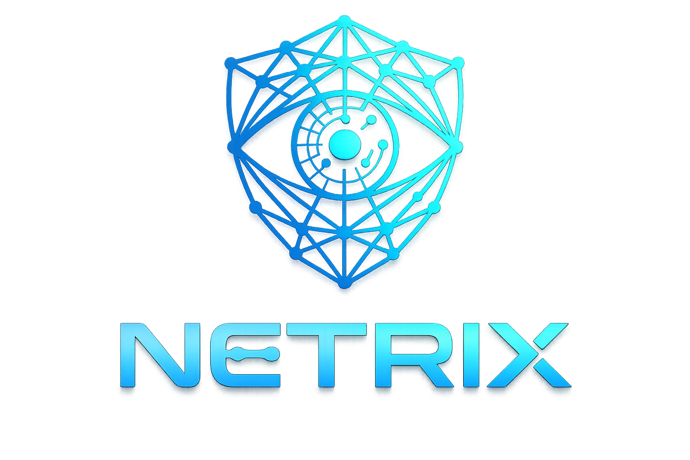

<p align="center">
  
</p>

<p align="center">
  <strong>Network Detection & Response (NDR)</strong><br/>
  Plataforma de monitoramento de rede, detecção de ameaças e resposta a incidentes em tempo real.
</p>

<p align="center">
  
  
  
  
  
  
</p>

---

## 📖 Sobre

O **Netrix** é uma plataforma NDR (Network Detection & Response) que transforma dados brutos de NetFlow/sFlow coletados pelo [pmacct](http://www.pmacct.net/) em inteligência de rede acionável. Ideal para equipes de SOC e administradores de rede que precisam de visibilidade total sobre o tráfego interno e externo da organização.

## ✨ Funcionalidades

- **Dashboard Executivo:** Métricas agregadas de bps, pps e fluxos em tempo real com gráficos comparativos
- **Traffic Explorer:** Análise granular de conversações por IP de origem/destino, portas e protocolos (TCP/UDP/ICMP)
- **Host Profiler:** Visão 360° de qualquer endereço IP (geolocalização via WHOIS, volume de tráfego, histórico e status)
- **Detecção de Ameaças (NDR):**
  - Identificação de Port Scanning horizontal e vertical
  - Detecção de ataques volumétricos (SYN Flood, UDP Flood, ICMP Flood)
  - Análise de picos anômalos de tráfego
- **Central de Resposta a Incidentes:**
  - Triagem e categorização de incidentes
  - Ações de mitigação direta (Baseline/Ignorar ou Escalar)
  - Notificações automáticas via Telegram Bot
- **Hosted Services:** Detecção automática de serviços ativos na infraestrutura (HTTP, HTTPS, DNS, SSH, etc.)
- **Multi-Tenant & RBAC:** Separação lógica por clientes/organizações com controle de acesso baseado em funções

## 🛠️ Stack Tecnológica

| Camada | Tecnologia |
|---|---|
| **Framework** | Next.js 16 (App Router, Server Actions) |
| **Frontend** | React 19, TailwindCSS 4, Recharts, Lucide Icons |
| **Backend** | Node.js, PostgreSQL (`pg` connection pool) |
| **Autenticação** | NextAuth.js v5 (Credentials Provider com `scrypt` hashing) |
| **Coleta de Fluxos** | pmacct (NetFlow v5/v9, IPFIX, sFlow) |
| **Linguagem** | TypeScript 5 (strict mode) |

## 📋 Pré-requisitos

- **Node.js** ≥ 20
- **PostgreSQL** ≥ 14
- **pmacct** configurado para coletar NetFlow/sFlow e gravar na tabela `flows`

## 🚀 Instalação

```bash
# 1. Clone o repositório
git clone https://github.com/seu-usuario/netrix.git
cd netrix

# 2. Instale as dependências
npm install

# 3. Configure as variáveis de ambiente
cp .env.example .env.local
# Edite o .env.local com as credenciais do seu banco

# 4. Execute o setup do banco de dados (cria as tabelas e o admin inicial)
npm run setup

# 5. Inicie o servidor de desenvolvimento
npm run dev
```

Acesse [http://localhost:3000](http://localhost:3000) e faça login com:
- **Email:** `admin@netrix.com`
- **Senha:** *(gerada aleatoriamente e exibida de forma segura no terminal durante o `npm run setup`)*

> 💡 Se preferir pré-definir a senha inicial do administrador, você pode declarar `ADMIN_INITIAL_PASSWORD=sua_senha` no seu `.env.local` antes de executar o `npm run setup`.

## ⚙️ Variáveis de Ambiente

| Variável | Descrição | Obrigatória |
|---|---|---|
| `AUTH_SECRET` | Chave secreta para JWT/sessões (gere com `openssl rand -base64 32`) | ✅ |
| `DB_HOST` | Host do PostgreSQL | ✅ |
| `DB_PORT` | Porta do PostgreSQL (padrão: 5432) | |
| `DB_NAME` | Nome do banco de dados (padrão: flowdb) | ✅ |
| `DB_USER` | Usuário do PostgreSQL | ✅ |
| `DB_PASS` | Senha do PostgreSQL | ✅ |
| `ADMIN_INITIAL_PASSWORD` | Senha customizada para o primeiro admin (se omitida, gera aleatória) | |
| `TELEGRAM_BOT_TOKEN` | Token do bot do Telegram para alertas | |

## 📁 Estrutura do Projeto

```
netrix/
├── scripts/                 # Setup e diagnóstico do banco
│   ├── setup-db.js          # Criação de tabelas e usuário admin
│   ├── check-schema.js      # Listagem de tabelas e colunas
│   └── schema.sql           # DDL completo (referência)
├── src/
│   ├── app/
│   │   ├── dashboard/       # Páginas do painel principal
│   │   │   ├── explorer/    # Busca avançada no tráfego
│   │   │   ├── hosts/       # Inventário e perfil de hosts
│   │   │   ├── security/    # Motor NDR e alertas
│   │   │   └── services/    # Serviços hospedados
│   │   ├── admin/           # Administração multi-tenant
│   │   └── login/           # Autenticação
│   ├── components/          # Componentes reutilizáveis (Sidebar, Modais)
│   └── lib/
│       ├── actions/         # Server Actions (queries PostgreSQL)
│       ├── cron/            # Notificador Telegram
│       ├── utils/           # Utilitários (rede, senhas, análise de serviços)
│       └── db.ts            # Pool de conexões PostgreSQL
├── .env.example             # Template de variáveis de ambiente
├── LICENSE                  # Licença MIT
└── package.json
```

## 🔒 Segurança

- Autenticação via NextAuth.js v5 com JWT
- Senhas hasheadas com `scrypt` (salt de 16 bytes + chave de 64 bytes)
- Queries parametrizadas (sem SQL injection)
- Middleware protege todas as rotas `/dashboard/*` e `/admin/*`

## 📄 Licença

Distribuído sob a licença [MIT](LICENSE). Veja `LICENSE` para mais detalhes.
